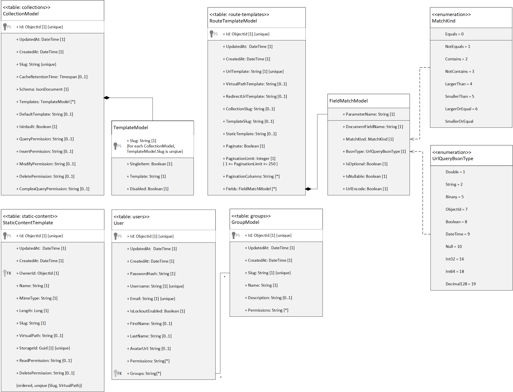

# HTMXBase
HTMXBase is a simple asp.net based drop in backend for simple websites. It is designed to work with the frontend framework HTMX. This Framework allows for a zero backend solution by offering built in solutions for the most common problems a backend solves:
- Login System with jwt and role / permission based access
- Custom Permission and Role creation
- Custom Table creation through the api
- Schema is enforced by the api
- All API endpoints support Form and Json data
- Extensive pagination support
- Backend template rendering using [Handlebars.NET](https://github.com/Handlebars-Net/Handlebars.Net)
- Automatic detection of requests from htmx and switching to html response
- Custom Routing
- Static file upload

# Getting Started
## Prerequisites
- Docker or Docker desktop
- Port 443 & 80 Open (Can be manually changed)

## Step 1
Clone the repo to your local machine:
```bash
git pull https://github.com/Aeolin/HTMXBase
```

## Step 2
Make sure nothing already binds to Port 443 or 80. If those ports are already in use either free them up or edit the [/docker-compose.yml](docker-compose.yml) and changed the port mapping for the nginx service.
```yml
nginx:
  image: ${DOCKER_REGISTRY-}nginx
  build:
    context: ./nginx
    dockerfile: Dockerfile

  container_name: nginx
  ports:
    - "80:80"    // Replace this port
    - "443:443"  // Replace this port
  depends_on:
    - htmxbase
    - express
```


## Step 3
Navigate into the clone folder and run docker compose up
```bash
docker compose up -d
```

## Step 4
Navigate to https://localhost and you should see the HTMXBase blog exmaple application. If you see this page then you have successfully set up HTMXBase.
If you don't want to see the example remove the seeding service from the [/docker-compose.yml](docker-compose.yml) file
If you want to access the mongo db it will be available at https://express.localhost

# Documentation
## Database Schema


## Schema Explanation
### EntityBase

All Entities which have their own table inherit from this class.

| Field | Type | Nullable | Unique | Description |
| ----- | ---- | -------- | ------ | ----------- |
| Id    | ObjectId | No | Yes | Unique Id of this entity |
| CreatedAt | DateTime | No | No | UTC Time when the entity was created |
| UpdatedAt | DateTime | No | No | UTC Time when the entity was last modified |

### UserCollectionBase

Since user collections are not reflected by a class they don't "inherit" from the BaseEntity but all Collections created through the api will have these properties added to their schema and housekept by the backend automatically

| Field | Type | Nullable | Unique | Description |
| ----- | ---- | -------- | ------ | ----------- |
| _id   | ObjectId | No | Yes | Unique Id of this entity |
| _ownerId | ObjectId | Yes | No | The UserId associated with the jwt that called the api to create this entry |
| _created | DateTime | No | No | UTC Time when the entity was created |
| _updated | DateTime | No | No | UTC Time when the entity was last modified |

### CollectionModel
Table: collections

Stores Metadata about all collection, user created as well as inbuilt collections


| Field | Type | Nullable | Unique | Description |
| ----- | ---- | -------- | ------ | ----------- |
| Slug | String | No | Yes | The url slug which uniquely identifies this collection in api requests |
| CacheRetentionTime | Yes | No | (Not Implemented) How long the templates should stay cached (currently templates stay cached forever or until they change) |
| Schema | JsonDocument | No | No | A Document Describing the schema of this collection. This is used to validate the data before it is inserted into the database. The schema is enforced by the database and will throw an error if the data does not match the schema. |
| Templates | [TemplateModel[]](#templatemodel) | No | No | A list of templates that are associated with this collection. These templates are used to render the data in the collection. |
| DefaultTemplate | String | Yes | No | The slug of the template to use by default if none is specified, if null api will return 404 if no template is specified in request |
| IsInbuilt | Boolean | No | No | If this collection is inbuilt or user created. Inbuilt collections are not modifyable except for their templates. |
| QueryPermission | String | Yes | No | Name of the permission required to paginate through entities in this collection. If null, no permission is required. |
| InsertPermission | String | Yes | No | Name of the permission required to insert entities into this collection. If null, no permission is required. |
| ModfiyPermission | String | Yes | No | Name of the permission required to modify entities in this collection. If null, no permission is required. |
| DeletePermission | String | Yes | No | Name of the permission required to delete entities in this collection. If null, no permission is required. |
| ComplexQueryPermission | String | Yes | No | Name of the permission required to use mongodb filters to paginate entities in this collection. If null, no permission is required. |

### TemplateModel

Stores html templates for a collection in [handlebars](https://github.com/Handlebars-Net/Handlebars.Net) syntax

| Field | Type | Nullable | Unique | Description |
| ----- | ---- | -------- | ------ | ----------- |
| Slug | String | No | Yes | The url slug which uniquely identifies this template in the context of the collection it belongs to |
| SingleItem | Booleans | No | No | If this template is used to render a single item or a list of items |
| Template | String | No | No | The [handlebars](https://github.com/Handlebars-Net/Handlebars.Net) template code |
| Disabled | Boolean | No | No | If this template is disabled or not. Disabled templates are not used to render the collection |

### StaticContentModel
Table: static-content

Table used to store metadata about uploaded static files

| Field | Type | Nullable | Unique | Description |
| ----- | ---- | -------- | ------ | ----------- |
| OwnerId | ObjectId | No | No | The UserId associated with the jwt that called the api to create this entry |
| Name | String | No | No | The name of the file uploaded (taken from multipart form data) |
| MimeType | String | No | No | The mime type of the file uploaded (taken from multipart form data) |
| Length | Long | No | No | The length of the file uploaded (taken from multipart form data) |
| Slug | String | No | Yes* | The url slug which uniquely identifies this file in the api |
| VirtualPath | String | Yes | Yes* | The virtual path of the file uploaded |
| StorageId | Guid | No | Yes | The id of the binary data inside the storage module of the file content |
| ReadPermission | String | Yes | No | The name of the permission required to read this file. If null, no permission is required. |
| DeletePermission | String | Yes | No | The name of the permission required to delete this file. If null, no permission is required. |

\* Compound Index, fields must only be unique in combination

### UserModel
Table: users

Stores user and login data

| Field | Type | Nullable | Unique | Description |
| ----- | ---- | -------- | ------ | ----------- |
| PasswordHash | String | No | No | The hashed password of the user |
| Username | String | No | Yes | The username of the user |
| Email | String | No | Yes | The email of the user |
| IsLockouted | Boolean | No | No | If this user is locked out or not |
| FirstName | String | Yes | No | The first name of the user |
| LastName | String | Yes | No | The last name of the user |
| AvatarUrl | String | Yes | No | The avatar of the user, per default created from email hash for [gravatar](https://gravatar.com/) |
| Permissions | String[] | Yes | No | The permissions of the user appended to the jwt |
| Groups | String[] | Yes | No | The slugs of the [groups](#groupmodel) the user is in, appended to the jwt |

### GroupModel
Table: groups

Stores groups and their permissions

| Field | Type | Nullable | Unique | Description |
| ----- | ---- | -------- | ------ | ----------- |
| Slug | String | No | Yes | The url slug which uniquely identifies this group in the api |
| Name | String | No | No | The name of the group |
| Description | String | Yes | No | The description of the group |
| Permissions | String[] | Yes | No | The permissions of the group appended to the jwt |

### RouteTemplateModel
Table: route-templates

Stores route templates for the custom routing system and comes in 3 modes of working
Route templates will try to match the requested url to their `UrlTemplate`. This template consists of uri path segments where a segment can either be a string value and has to be matched exactly (case-insesitive) or a segment is enclosed by curly braces `{segment}` and match any url legal path segment and store the value in the route parameter dictionary with the value between the curly braces as key. After matching the url, all query values will be appended to the parameter dictionary. If a query value is set multiple times only the first value will be taken, array matching is not supported.

#### Default Mode
This mode will match entities in a given collection and render them into a given template of that collection and return the rendered content as html. The collection is either specified by `CollectionSlug` or by a `parameter` or query value named 'collectionSlug'. `Fields` dictate how the values in the parameter dictionary are used for comparison with the collection entities. `TemplateSlug` or a parameter 'templateSlug' or the `DefaultTemplate` of the collection dictate which template is used to render the item (denoted in order of precendence). If all are null the backend response with 404 error. 

Additionally `BaseTemplatePathTemplate` can be set which will get formatted* and should result in a Url or ObjectId. If this value is set the [static content](#staticcontentmodel) matched by ObjectId or Url is used as a base [handlebars](https://github.com/Handlebars-Net/Handlebars.Net) template the prior rendered content is inserted into.

#### Static Content Mode
This mode will use the parameter dictionary to format* the `VirtualPathTemplate` which should result in an ObjectId or Url. This will return the raw content of the [static content](#staticcontentmodel) matched by the ObjectId or Url.

*This mode will be chosen if `VirtualPathTemplate` is not null* 

#### Redirect Mode
This model will use the parameter dictionary to format* the `RedirectUrlTemplate` which should result in an Url the caller is redirected to.

*This mode will be chosen if `RedirectUrlTemplate` is not null*

#### Formatting*
Formatting is done by replacing all parameters `{parameterName}` with the value of the parameter dictionary.

| Field | Type | Nullable | Unique | Description |
| ----- | ---- | -------- | ------ | ----------- |
| UrlTemplate | String | No | Yes | The url template for this route where parameters are formatted as `{parameterName}` |
| VirtualPathTemplate** | String | Yes | No | If not null, this route will match [static content](#staticcontentmodel) and return the content of the file, the template will replace parameters `{parameter}` taken form the `UrlTemplate` and query. Alternatively this can be an ObjectId referencing a [StaticContentModel](#staticcontentmodel) directly |
| RedirectUrlTemplate** | String | Yes | No | If not null, this route will redirect to this url instead of rendering a template, the template will replace parameters `{parameter}` taken form the `UrlTemplate` and query.|
| CollectionSlug | String | Yes | No | If this route points to a collection this sepcifies which collection it points to. If null the url is expected to either contain a parameter `{collectionSlug}` or a query paramater of the same name |
| TemplateSlug | String | Yes | No | If this route points to a template this sepcified which template it points to. If null the slug is taken from the url parameter `{templateSlug}` or a query paramater of the same name. If non is specified the `DefaultTemplate` in the collection will be used |
| BaseTemplatePathTemplate | String | Yes | No | If not null, this route has a base template specified. The path will match [static content](#staticcontentmodel) and use the content as a [handlebars](https://github.com/Handlebars-Net/Handlebars.Net) template. The template will be filled as usual where the render output of the matched collection content is passed in as `Data`. |
| Paginate | Boolean | No | No | If true, this route will paginate the collection and the Data passed to the template will be wrapped inside a [CursorResult<BsonDocument, string>](#cursorresult) |
| PaginationLimit | Int | Yes | No | The default number of items to return per page. 1 <= n <= 250 |
| PaginationColumns | String[] | Yes | No | The columns to paginate by. If null `_id` is used by default |
| PaginateAscending | Boolean | Yes | No | If true, the items will be paginated in ascending order by default |
| Fields | [FieldMatchModel[]](#fieldmatchmodel) | Yes | No | Metadata describing how comparison is done between collection items and the url parameters and query values |

\** Logically exclusive to each other if both are set, redirect will take precedence.

### FieldMatchModel

Describes how the matching process between a collection and the [RouteTemplateModel](#routetemplatemodel) happens

| Field | Type | Nullable | Unique | Description |
| ----- | ---- | -------- | ------ | ----------- |
| ParameterName | String | No | No | The name of the parameter in the url or query |
| CollectionFieldName | String | No | No | The name of the field in the collection |
| MatchKind | [MatchKind](#matchkind) | No | No | The kind of comparison to use |
| BsonType* | [UrlQueryBsonType](#bsontype) | No | No | The bson type the parameter value should be interpreted as during coparison |
| IsOptional | Boolean | No | No | If true, this parameter is optional and will not result in a 404 if not present in the url or query |
| IsNullable | Boolean | No | No | If true, this parameter is allowed to have a null value |
| UrlEncode | Boolean | No | No | **Only applicable if `BsonType` = 2 (`String`)** If true, this parameter will be/stay url encoded for comparison |
| Value | String | Yes | No | The value of the parameter, if set this will be used for comparison instead of the parameter value from the url or query (mainly used to set non user controllable constrains) |

\* Can't be derived from the collection schema because one [RouteTemplateModel](#routetemplatemodel) can match multiple collections

### MathKind
Enum denoting comparison operation

| Name | Int Value | Description |
| ---- | --------- | ----------- |
| Equals | 0 | The value of the parameter must be equal to the value of the collection field |
| NotEquals | 1 | The value of the parameter must not be equal to the value of the collection field |
| Contains | 2 | The array of the collection field contains the parameter value |
| NotContains | 3 | The array of the collection field contains the parameter value |
| LargerThan | 4 | The value of the collection field must be larger than the parameter value |
| SmallerThan | 5 | The value of the collection field must be smaller than the parameter value |
| LargerOrEquals | 6 | The value of the collection field must be larger than or equal to the parameter value |
| SmallerOrEquals | 7 | The value of the collection field must be smaller or equal to the parameter value |
| Regex | 8 | The value of the collection field must match the regex specified by the parameter value |

### UrlQueryBsonType
Enum denoting a subset of valud bson type the parameter value should be interpreted as

| Name | Int Value | .NET Type |
| ---- | --------- | ----------- |
| Double | 1 | System.Double |
| String | 2 | System.String |
| Binary* | 5 | System.Byte[] |
| ObjectId | 7 | MongoDB.Bson.ObjectId |
| Boolean | 8 | System.Boolean |
| DateTime | 9 | System.DateTime |
| Null | 10 | null |
| Int32 | 16 | System.Int32 |
| Int64 | 18 | System.Int64 |
| Decimal128 | 19 | System.Decimal |

\* The parameter value will be interpreted as a base64 string and converted to a byte array

## Permissions

HTMXBase uses a simple permission system to control access to the api. Permissions are stored in the jwt and can be checked by the backend. Permission will be constructed from user permissions and Group Permissions. If a user is the owner (`_ownerId` equals to the user id of the entity) the user has total modify, delete and read permission over this entity even when not having the required permission specified in the collection. This gives users total power over the data they uploaded themselves

## Rendering
All Template Rendering is done by [handlebars](https://github.com/Handlebars-Net/Handlebars.Net). The Object passed to the template has two fields `User` and `Data`.
`User` is a [UserModel](#usermodel) and is either null when the request was made without a valid jwt or set to the user identified by the jwt. `Data` is either a `BsonDocument`,  `BsonDocument[]` or a [`PaginationResult<BsonDocument>`](#paginationresult). For compatibility and ease of use, all `BsonDocument` will be deserialized to `Dictionary<string, object>` prior to being rendered by handlebars

The following additional [handlebars](https://github.com/Handlebars-Net/Handlebars.Net) helpers are available:

- [HandlebarsHelpers](https://github.com/Handlebars-Net/Handlebars.Net.Helpers)
- `#eq x y` conditional if `x` is equal to `y`
- `#render-md x` parses the content of `x` as markdown (commonmark) and converts it to html using [Markdig](https://github.com/xoofx/markdig)
- `#exists-len x len? cmp y` checks if `x` exists and has a length of `len` and compares it to `y` using the comparison operator `cmp` if `len?` is set the length of the value of the property `len` will be compared instead
- `#ncmp x cmp y` conditional which compares `x` to `y` using the comparison operator `cmp`

## Pagination
Pagination is handeled by the `PaginationService` class. Pagination uses the reserved url parameters `cursorNext`, `cursorPrevious`, `orderBy`, `limit` and `asc`. The cursor values are used to retrieve the next or previous page of items, `limit` specifies the count of items per page, `asc` defines if the values are ordered ascending or descending and `orderBy` is a list of fields the pagination orders the results by. The cursor are Base64 encoded representations of all fields used for ordering. 

### CursorResult
The generic class `CursorResult<TRes, TCursor>` is used to wrap the result of a paginated query. It contains the following properties: 

| Property | Type | Nullable | Description |
| -------- | ---- | ------ | ------- |
| Items | TRes[] | No | The items returned by the query |
| Next | TCursor | Yes | The cursor for the next page of items if there are more items else null |
| Previous | TCursor | Yes | The cursor for the previous page of items if there is a previous page else null |

## Form and Json Handling
When using the api to insert data into collection both, json and form data are allowed and valid. Both will be mapped to a BsonDocument by using the BsonSchema of the collection targeted in the post. Form Data will be mapped to a JsonDocument first before mapping the JsonDocument to a BsonDocument. Mapping works by splitting each form key by the `.` character and using the parts a nested objects inside the main json document. Arrays can be created by appending `[index]` to the end of a part.

### Example

Consider the following form data and collection json schema

#### Form Data
- id = 67d2fabb631789e4f08075d4
- name = Johne Doe
- age = 21
- address.street = 123 Main St
- address.city = New York
- address.state = NY
- address.zip = 10001
- address.country = USA
- address.phone[0] = 1234567890
- address.phone[1] = 0987654321

First the form data will be converted to a json document
#### Converted Form Data
```json
{
  "id": "67d2fabb631789e4f08075d4",
  "name": "Johne Doe",
  "age": "21",
  "address": {
    "street": "123 Main St",
    "city": "New York",
    "state": "NY",
    "zip": "10001",
    "country": "USA",
    "phone": [
      "1234567890",
      "0987654321"
    ]
  }
}
```

Note that all properties are string in this itermediate result, even numbers. This can't be done differently since form data only contains strings. The backend will try to convert the values to the correct type when inserting them into the database. If the conversion fails an error will be thrown.

The conversion happens by using the schema and parsing the values according to the schema

#### Schema
```json
{
  "type": "object",
  "properties": {
    "id": {
      "bsonType": "objectId"
    },
    "name": {
      "bsonType": "string"
    },
    "age": {
      "bsonType": "int"
    },
    "address": {
      "type": "object",
      "properties": {
        "street": {
          "bsonType": "string"
        },
        "city": {
          "bsonType": "string"
        },
        "state": {
          "bsonType": "string"
        },
        "zip": {
          "bsonType": "string"
        },
        "country": {
          "bsonType": "string"
        },
        "phone": {
          "bsonType": "array",
          "items": {
            "bsonType": "string"
          }
        }
      }
    }
  }
}
```
This will result in the following BsonDocument

#### BsonDocument
```json
{
  "id": {
    "$oid": "67d2fabb631789e4f08075d4"
  },
  "name": "Johne Doe",
  "age": 21,
  "address": {
    "street": "123 Main St",
    "city": "New York",
    "state": "NY",
    "zip": "10001",
    "country": "USA",
    "phone": [
      "1234567890",
      "0987654321"
    ]
  }
}
```

## Api

List of all api endpoints and their parameters as well as responses.
Note `pagination` in Query field means all pagination values specified in the [Pagination](#pagination) section

To see an example how to use the api take a look at the [requests.sh](/seeding/requests.sh) file the seeding service uses to create the blog demo application
Alternatively there is also a RedDoc instance running at [/swagger](http://localhost/swagger)

### Output Fomatter
The api by default will respond in Json. If the Accept header is set to `text/html` or the request is made by HTMX the api will respond with a rendered template. The template is specified by the `Hx-Tempalte` header or the `templateSlug` or the  query parameter or the `DefaultTemplate` of the collection. If no template is specified and no default template is set, the api will return a 404 error.

`TemplateSource` denotes the collection the tempalte will be source from, this is only applicable for inbuilt collections, otherwise the collectionSlug and templateSlug get source from the matched route as described in [routing](#routetemplatemodel)

### AdminController
/api/v1/admin

| Method | SubPath | Content | Query | Response Type | Status Codes | Permission | Template Source | Description | 
| ------ | ------- | ------- | ----- | ------------- | ------------ | ---------- | --------------- | ----------- |
| Get | /groups | - |  `pagination` | [CursorResult](#cursorresult)<[ApiGroup](#apigroup), String>] | 200, 403  | admin/get-group | groups | Paginate over all groups |
| Post | /groups | [ApiGroup](#apigroup) | - | [ApiGroup](#apigroup) | 200, 403 | admin/create-group | groups | Creates a new group and returns the created object | 
| Delete | /groups/\{slug} | - | - | - | 200, 404, 403 | admin/delete-group | - | Deletes a group by slug |
| Put | /groups/\{slug} | [ApiUpdateGroupRequest](#apiupdategrouprequest) | - | [ApiGroup](#apigroup) | 200, 404, 403 | admin/update-group | groups | Updates a group by slug |
| Get | /groups/\{slug} | - | - | [ApiGroup](#apigroup) | 200, 404, 403 | admin/get-group | groups | Gets a group by slug |
| Put | /group/\{slug}/permissions | [ApiSetPermissionRequest](#apisetpermissionrequest) | - | [ApiGroup](#apigroup) | 200, 404, 403 | admin/update-group | groups | Updates the permissions of a group by slug |
| Delete | /group/\{slug}/permissions | [ApiSetPermissionRequest](#apisetpermissionrequest) | - | [ApiGroup](#apigroup) | 200, 404, 403 | admin/delete-group | groups | Deletes the permissions of a group by slug |
| Get | /groups/\{slug}/permissions | - | - | string[] | 200, 404, 403 | admin/get-group | groups | Gets the permissions of a group by slug |
| Get | /users | - |  `pagination` | [CursorResult](#cursorresult)<[ApiUser](#apiuser), String> | 200, 403 | admin/get-user | users | Paginate over all users |
| Get | /users/search | - | `pagination`, `name`, `email` | [CursorResult](#cursorresult)<[ApiUser](#apiuser), String> | 200, 403 | admin/get-user | users | Paginate over all users filtered by partial match of email with the users email and name with the users FirstName, LastName and UserName |
| Get | /users/\{id} | - | - | [ApiUser](#apiuser) | 200, 404, 403 | admin/get-user | users | Gets a user by id |
| Put | /users/\{id} | [ApiUser](#apiuser) | - | [ApiUser](#apiuser) | 200, 404, 403 | admin/update-user | users | Updates a user by id |
| Get | /users/\{id}/groups | - | - | [ApiGroup[]](#apigroup) | 200, 404, 403 | admin/get-user | groups | Gets the groups of a user by id |
| Put | /users/\{id}/groups | [ApiSetGroupRequest[]](#apisetgrouprequest) | - | [ApiUser](#apiuser) | 200, 404, 403 | admin/update-user | users | Updates the groups of a user by id |
| Delete | /users/\{id}/groups | [ApiSetGroupRequest[]](#apisetgrouprequest) | - | [ApiUser](#apiuser) | 200, 404, 403 | admin/delete-user | users | Deletes the groups of a user by id |


#### ApiGroup
| Name | Type | Nullable | Description |
| ---- | ---- | -------- | ----------- |
| Slug | String | No | The slug of the group |
| Name | String | No | The name of the group |
| Description | String | Yes | The description of the group |
| Permissions | String[] | Yes | The permissions of the group |

#### ApiUpdateGroup
| Name | Type | Nullable | Description |
| ---- | ---- | -------- | ----------- |
| Slug | String | Yes | The slug of the group |
| Name | String | Yes | The name of the group |
| Description | String | Yes | The description of the group |
| Permissions | String[] | Yes | The permissions of the group |


#### ApiSetPermissionRequest
| Name | Type | Nullable | Description |
| ---- | ---- | -------- | ----------- |
| Permissions | String[] | Yes | The permissions to set or remove |

#### ApiUser
| Name | Type | Nullable | Description |
| ---- | ---- | -------- | ----------- |
| Id | ObjectId | No | The id of the user |
| Username | String | No | The username of the user |
| Email | String | No | The email of the user |
| FirstName | String | Yes | The first name of the user |
| LastName | String | Yes | The last name of the user |
| AvatarUrl | String | Yes | The avatar of the user |
| IsLockoutEnabled | Boolean | No | If this user is locked out or not |
| Permissions | String[] | Yes | The permissions of the user |
| Groups | [ApiGroup[]](#apigroup) | Yes | The groups the user is in |

#### ApiSetGroupRequest
| Name | Type | Nullable | Description |
| ---- | ---- | -------- | ----------- |
| Groups | String[] | Yes | The slugs of the groups to set or remove |

### AuthController
/api/v1/auth

| Method | SubPath | Content | Query | Response Type | Status Codes | Permission | Template Source | Description |
| ------ | ------- | ------- | ----- | ------------- | ------------ | ---------- | --------------- | ----------- |
| Post | /register | [ApiRegisterRequest](#apiregisterrequest) | - | [ApiUser](#apiuser) | 200, 403 | - | - | Creates a new user and returns the created object |
| Post | /login | [ApiLoginRequest](#apiloginrequest) | `useCookie` | String | 200, 403 | - | - | Logs in a user and returns the jwt or sets it as cookie based on the `useCookie` query parameter |
| Get | /logout | - | - | - | 200, 403 | - | - | Logs out a user and deletes the cookie |
| Post | /refresh-token | - | `useCookie` | String | 200, 403 | - | - | Refreshes the jwt and returns it or sets it as cookie based on the `useCookie` query parameter |

#### ApiRegisterRequest
| Name | Type | Nullable | Description |
| ---- | ---- | -------- | ----------- |
| Email | String | No | The email of the user |
| Password | String | No | The password of the user |
| Username | String | Yes | The username of the user, will be set to the email if null |
| FirstName | String | Yes | The first name of the user |
| LastName | String | Yes | The last name of the user |
| AvatarUrl | String | Yes | The avatar of the user, will be set to the gravatar url if null |

#### ApiLoginRequest
| Name | Type | Nullable | Description |
| ---- | ---- | -------- | ----------- |
| UsernameOrEmail | String | No | The email or username of the user |
| Password | String | No | The password of the user |

### CollectionController
/api/v1/collections

| Method | SubPath | Content | Query | Response Type | Status Codes | Permission | Template Source | Description |
| ------ | ------- | ------- | ----- | ------------- | ------------ | ---------- | --------------- | ----------- |
| Get | /\{collectionSlug}/paginate | - | `pagination` | [CursorResult](#cursorresult)<[BsonDocument](#bsondocument), String> | 200, 403 |  | collectionSlug | Paginate over all items in a collection |
| Post | /\{colllectionSlug}/paginate | `pagination` from Form | - | [CursorResult](#cursorresult)<[BsonDocument](#bsondocument), String> | 200, 403 |  | collectionSlug | Paginate over all items in a collection |
| Post | /\{collectionSlug} | [JsonDocument](#form-data) | - | [BsonDocument](#bsondocument) | 200, 403 |  | collectionSlug | Inserts a new item into a collection |
| Put | /\{collectionSlug}/\{documentId} |  [JsonDocument](#form-data) | - | [BsonDocument](#bsondocument) | 200, 403 |  | collectionSlug | Updates an item in a collection |
| Get | /\{collectionSlug}/\{documentId} | - | - | [BsonDocument](#bsondocument) | 200, 403 |  | collectionSlug | Gets an item in a collection |
| Delete | /\{collectionSlug}/\{documentId} | - | - | - | 200, 403 |  | collectionSlug | Deletes an item in a collection |
| Post | /\{collectionSlug}/query | [JsonDocument](#form-data) | `pagination` | [CursorResult](#cursorresult)<[BsonDocument](#bsondocument), String> | 200, 403 |  | collectionSlug | Paginate over all items in a collection using a mongodb filter |
| Post | /\{collectionSlug}/templates | [ApiTemplate](#apitemplate), Optional FormFile named templateFile for template content | - | [ApiTemplate](#apitemplate) | 200, 403 | collections/create-template | - | Add a template to a collection |
| Put | /\{collectionSlug}/templates/\{templateSlug} | [ApiTemplate](#apitemplate), Optional FormFile named templateFile for template content | - | [ApiTemplate](#apitemplate) | 200, 403 | collections/modify-template | - | Updates a template in a collection |
| Delete | /\{collectionSlug}/templates/\{templateSlug} | - | - | - | 200, 403 | collections/delete-template | - | Deletes a template in a collection |
| Put | /\{collectionSlug}/default-template/\{templateSlug} | - | - | - | 200, 403 | collections/modify | - | Sets the default template for a collection |
| Put | /\{collectionSlug} | | [ApiCollectionUpdateRequest](#apicollection) | - | [ApiCollectionUpdateRequest](#apicollection) | 200, 403 | collections/modify | - | Updates a collection, Schema change is not supported yet, |
| Get | / | - | - | [ApiCollection[]](#apicollection) | 200, 403 | collections/get | - | Gets all collections |
| Get | /paginate | - | `pagination` | [CursorResult](#cursorresult)<[ApiCollection](#apicollection), String> | 200, 403 | collections/get | - | Paginate over all collections |
| Post | /paginate | `pagination` from Form | - | [CursorResult](#cursorresult)<[ApiCollection](#apicollection), String> | 200, 403 | collections/get | - | Paginate over all collections |
| Delete | /\{collectionSlug} | - | - | - | 200, 403 | collections/delete | - | Deletes a collection |
| Post | /schema-as-file | [ApiCollection](#apicollection), FormFile named schemaFile containing the schema | - | [ApiCollection](#apicollection) | 200, 403 | collections/create | - | Creates a new collection and returns the created object |
| Post | / | [ApiCollection](#apicollection) | - | [ApiCollection](#apicollection) | 200, 403 | collections/create | - | Creates a new collection and returns the created object |


#### ApiTemplate
| Name | Type | Nullable | Description |
| ---- | ---- | -------- | ----------- |
| Slug | String | No | The slug of the template |
| SingleItem | Boolean | No | If this template is used to render a single item or a list of items |
| Template | String | No | [handlebars](https://github.com/Handlebars-Net/Handlebars.Net) template code |
| Disabled | Boolean | No | If this template is disabled or not. Disabled templates are not used to render the collection |

#### ApiCollection
| Name | Type | Nullable | Description |
| ---- | ---- | -------- | ----------- |
| Slug | String | No | The slug of the collection |
| Name | String | No | The name of the collection |
| CacheRetentionTime | Int | Yes | How long the templates should stay cached (not implemented yet, currently templates stay cached forever or until they change) |
| Schema | JsonDocument | No | The schema of the collection |
| Templates | [ApiTemplate[]](#apitemplate) | Yes | A list of templates that are associated with this collection. These templates are used to render the data in the collection. |
| DefaultTemplate | String | Yes | The slug of the template to use by default if none is specified, if null api will return 404 if no template is specified in request |
| IsInbuilt | Boolean | No | If this collection is inbuilt or user created. Inbuilt collections are not modifyable except for their templates. |
| QueryPermission | String | Yes | No | Name of the permission required to paginate through entities in this collection. If null, no permission is required. |
| InsertPermission | String | Yes | No | Name of the permission required to insert entities into this collection. If null, no permission is required. |
| ModfiyPermission | String | Yes | No | Name of the permission required to modify entities in this collection. If null, no permission is required. |
| DeletePermission | String | Yes | No | Name of the permission required to delete entities in this collection. If null, no permission is required. |
| ComplexQueryPermission | String | Yes | No | Name of the permission required to use mongodb filters to paginate entities in this collection. If null, no permission is required. |

#### ApiCollectionUpdateRequest
| Name | Type | Nullable | Description |
| ---- | ---- | -------- | ----------- |
| Slug | String | No | The slug of the collection |
| Name | String | No | The name of the collection |
| CacheRetentionTime | Int | Yes | How long the templates should stay cached (not implemented yet, currently templates stay cached forever or until they change) |
| DefaultTemplate | String | Yes | The slug of the template to use by default if none is specified, if null api will return 404 if no template is specified in request |
| QueryPermission | String | Yes | No | Name of the permission required to paginate through entities in this collection. If null, no permission is required. |
| InsertPermission | String | Yes | No | Name of the permission required to insert entities into this collection. If null, no permission is required. |
| ModfiyPermission | String | Yes | No | Name of the permission required to modify entities in this collection. If null, no permission is required. |
| DeletePermission | String | Yes | No | Name of the permission required to delete entities in this collection. If null, no permission is required. |
| ComplexQueryPermission | String | Yes | No | Name of the permission required to use mongodb filters to paginate entities in this collection. If null, no permission is required. |

### RouteController
/api/v1/routes

| Method | SubPath | Content | Query | Response Type | Status Codes | Permission | Template Source | Description |
| ------ | ------- | ------- | ----- | ------------- | ------------ | ---------- | --------------- | ----------- |
| Get | / | - | `pagination` | [CursorResult](#cursorresult)<[ApiRouteTemplate](#apiroutetemplate), String> | 200, 403 | routes/get | routes | Paginate over all routes |
| Get | /search | - | `pagination`, `regex` | [CursorResult](#cursorresult)<[ApiRouteTemplate](#apiroutetemplate), String> | 200, 403 | - | routes | Paginate over all routes with `UrlTemplate` filtered by the given regex |
| Post | / | [ApiRouteTemplate](#apiroutetemplate) | - | [ApiRouteTemplate](#apiroutetemplate) | 200, 403 | routes/create | routes | Creates a new route and returns the created object |
| Post | /\{id}/fields | [ApiFieldMatchModel](#apifieldmatchmodel) | - | [ApiRouteTemplate](#apiroutetemplate) | 200, 403 | routes/update | routes | Creates a new field match model and returns the update route model |
| Put | /\{id}/fields/{parameterName} | [ApiFieldMatchModel](#apifieldmatchmodel) | - | [ApiRouteTemplate](#apiroutetemplatemodel) | 200, 403 | routes/update | routes | Updates a field match model and returns the updated route model |
| Delete | /\{id}/fields/{parameterName} | - | - | [ApiRouteTemplate](#apiroutetemplatemodel) | 200, 403 | routes/update | - | Deletes a field match model and returns the updated route model |
| Put | /\{id} | [ApiRouteTemplate](#apiroutetemplatemodel) | - | [ApiRouteTemplate](#apiroutetemplatemodel) | 200, 403 | routes/update | routes | Updates a route and returns the updated route model |
| Delete | /\{id} | - | - | - | 200, 403 | routes/delete | - | Deletes a route |

#### ApiRouteTemplate
| Name | Type | Nullable | Description |
| ---- | ---- | -------- | ----------- |
| Id | ObjectId | No | The id of the route |
| UrlTemplate | String | No | The url template for this route where parameters are formatted as `{parameterName}` |
| CollectionSlug | String | Yes | No | If this route points to a collection this sepcifies which collection it points to. If null the url is expected to either contain a parameter `{collectionSlug}` or a query paramater of the same name |
| TemplateSlug | String | Yes | No | If this route points to a template this sepcified which template it points to. If null the slug is taken from the url parameter `{templateSlug}` or a query paramater of the same name. If non is specified the `DefaultTemplate` in the collection will be used |
| RedirectUrlTemplate | String | Yes | No | If not null, this route will redirect to this url instead of rendering a template, the template will replace parameters `{parameter}` taken form the `UrlTemplate` and query.|
| VirtualPathTemplate | String | Yes | No | If not null, this route will match [static content](#staticcontentmodel) and return the content of the file, the template will replace parameters `{parameter}` taken form the `UrlTemplate` and query. Alternatively this can be an ObjectId referencing a [StaticContentModel](#staticcontentmodel) directly |
| BaseTemplatePathTemplate | String | Yes | If not null, this route has a base template specified. The path will match [static content](#staticcontentmodel) and use the content as a [handlebars](https://github.com/Handlebars-Net/Handlebars.Net) template. The template will be filled as usual where the render output of the matched collection content is passed in as `Data`. 
| Paginate | Boolean | No | If true, this route will paginate the collection and the Data passed to the template will be wrapped inside a [CursorResult<BsonDocument, string>](#cursorresult) |
| PaginationLimit | Int | No | The default number of items to return per page. 1 <= n <= 250 |
| PaginationColumns | String[] | Yes | The columns to paginate by. If null `_id` is used by default |
| PaginateAscending | Boolean | Yes  | If true, the items will be paginated in ascending order by default |
| Fields | [ApiFieldMatchModel[]](#apifieldmatchmodel) | Yes | Metadata describing how comparison is done between collection items and the url parameters and query values |


#### ApiFieldMatchModel
| Name | Type | Nullable | Description |
| ---- | ---- | -------- | ----------- |
| ParameterName | String | No | The name of the parameter in the url or query |
| DocumentFieldName | String | No | The name of the field in the collection |
| MatchKind | [MatchKind](#matchkind) | No | The kind of comparison to use |
| BsonType* | [UrlQueryBsonType](#bsontype) | No | The bson type the parameter value should be interpreted as during coparison |
| IsOptional | Boolean | No | If true, this parameter is optional and will not result in a 404 if not present in the url or query |
| IsNullable | Boolean | No | If true, this parameter is allowed to have a null value |
| UrlEncode | Boolean | No | **Only applicable if `BsonType` = 2 (`String`)** If true, this parameter will be/stay url encoded for comparison |
| Value | String | Yes | The value of the parameter, if set this will be used for comparison instead of the parameter value from the url or query (mainly used to set non user controllable constrains) |

### StaticContentController
/api/v1/static-content

| Method | SubPath | Content | Query | Response Type | Status Codes | Permission | Template Source | Description |
| ------ | ------- | ------- | ----- | ------------- | ------------ | ---------- | --------------- | ----------- |
| Get | /dir | - | `path` | String[] | 200 | files/read | - | Gets all files in a virtual directory |
| Post | / | [StaticContentForm](#staticcontentform) | - | ObjectId | 200, 403 | files/upload | - | Creates a new static content file |
| Delete | /\{id} | - | - | - | 200, 403 | files/delete | - | Deletes a static content file |

#### StaticContentForm
form data for static content upload

| Name | Type | Nullable | Description |
| ---- | ---- | -------- | ----------- |
| File | FormFile | No | The file to upload |
| Slug | String | Yes | The slug of the file if null uses the form file name url encoded |
| VirtualPath | String | Yes | The virtual path of the file if null default to '/' |
| DeletePermission | String | Yes | The permission required to delete this file if null no permission is required |
| ReadPermission | String | Yes | The permission required to read this file if null no permission is required |

### UserController
/api/v1/user

| Method | SubPath | Content | Query | Response Type | Status Codes | Permission | Template Source | Description |
| ------ | ------- | ------- | ----- | ------------- | ------------ | ---------- | --------------- | ----------- |
| Get | /self | - | - | [ApiUser](#apiuser) | 200, 403 | user/get-self | users | Gets the current user |
| Put | /self | [ApiUserUpdateRequest](#apiuserupdaterequest) | - | [ApiUser](#apiuser) | 200, 403 | user/modify-self | users | Updates the current user |

#### ApiUserUpdateRequest
| Name | Type | Nullable | Description |
| Username | String | Yes | The username of the user |
| Email | String | Yes | The email of the user |
| FirstName | String | Yes | The first name of the user |
| LastName | String | Yes | The last name of the user |
| AvatarUrl | String | Yes | The avatar of the user |
